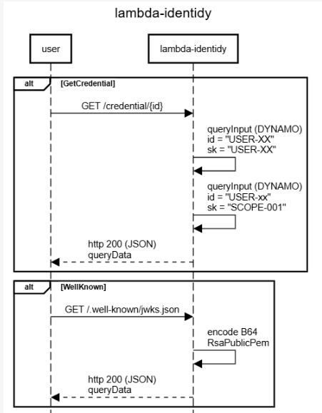
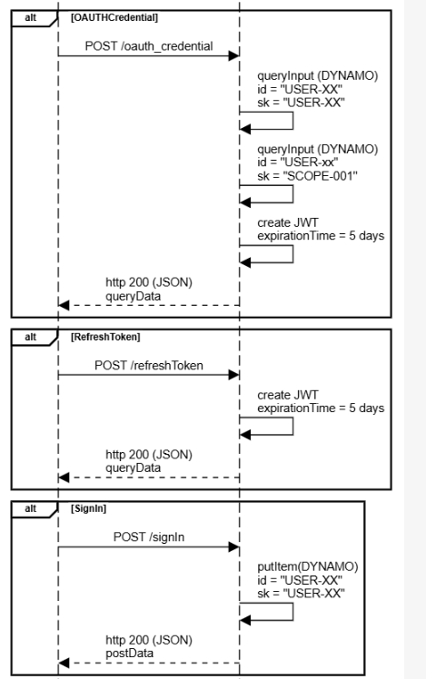
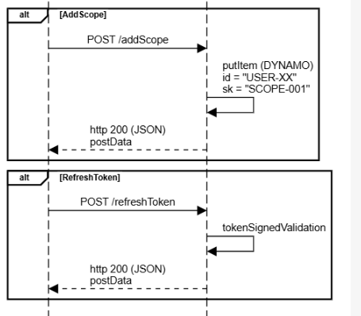

## lambda-go-identidy

   This is workload for POC purpose such as load stress test, gitaction, etc.

   The main purpose is handle all identidy lifecycle (create a user, refresh token, token validation, login and etc)

   There are 2 methods of JWT signature
   RSA (private key)
   HSA (symetric key)

## Diagram Sequence

        
        title lambda-identidy

        participant user
        participant lambda-identidy
        
        entryspacing 0.7

        alt GetCredential
        user->lambda-identidy:GET /credential/{id}
        lambda-identidy->lambda-identidy:queryInput (DYNAMO)\nid = "USER-XX"\nsk = "USER-XX"
        lambda-identidy->lambda-identidy:queryInput (DYNAMO)\nid = "USER-xx"\nsk = "SCOPE-001"
        user<--lambda-identidy:http 200 (JSON)\nqueryData
        end
        alt WellKnown
        user->lambda-identidy:GET /.well-known/jwks.json
        lambda-identidy->lambda-identidy:encode B64\nRsaPublicPem
        user<--lambda-identidy:http 200 (JSON)\nqueryData

        end

        alt OAUTHCredential
        user->lambda-identidy:POST /oauth_credential
        lambda-identidy->lambda-identidy:queryInput (DYNAMO)\nid = "USER-XX"\nsk = "USER-XX"
        lambda-identidy->lambda-identidy:queryInput (DYNAMO)\nid = "USER-xx"\nsk = "SCOPE-001"
        lambda-identidy->lambda-identidy:create JWT\nexpirationTime = 5 days
        user<--lambda-identidy:http 200 (JSON)\nqueryData
        end
        alt RefreshToken
        user->lambda-identidy:POST /refreshToken
        lambda-identidy->lambda-identidy:create JWT\nexpirationTime = 5 days
        user<--lambda-identidy:http 200 (JSON)\nqueryData
        end
        alt SignIn
        user->lambda-identidy:POST /signIn
        lambda-identidy->lambda-identidy:putItem(DYNAMO)\nid = "USER-XX"\nsk = "USER-XX"
        user<--lambda-identidy:http 200 (JSON)\npostData
        end
        alt AddScope
        user->lambda-identidy:POST /addScope
        lambda-identidy->lambda-identidy:putItem (DYNAMO)\nid = "USER-XX"\nsk = "SCOPE-001"
        user<--lambda-identidy:http 200 (JSON)\npostData
        end
        alt RefreshToken
        user->lambda-identidy:POST /refreshToken
        lambda-identidy->lambda-identidy:tokenSignedV

## Enviroments

   For local test, create a AWS credentials and run the make file

    make

## Endpoints

curl --location 'https://mydomain.com/identidy/info'

curl --location 'https://mydomain.com/identidy/credential/admin-003'

curl --location 'https://mydomain.com/identidy/oauth_credential' \
    --header 'Content-Type: application/json' \
    --data '{
        "user":"admin-003",
        "password":"admin-003"
    }'

curl --location 'https://mydomain.com/identidy/refreshToken' \
    --data '{
        "token": "eyJhbGc....dbg"
    }'

curl --location 'https://mydomain.com/identidy/tokenValidation' \
    --data '{
        "token": "eyJhbG...Psg"
    }'

curl --location 'https://mydomain.com/identidy/signIn' \
    --header 'Content-Type: application/json' \
    --data '{
        "user":"admin-003",
        "password":"admin-003",
        "tier": "tier2",
        "api_access_key" : "API_ACCESS_KEY_ADMIN_003"
    }'

 curl --location 'https://mydomain.com/identidy/addScope' \
    --data '{
        "user": "admin-003",
        "scope": ["test.read","test.write", "admin"]
    }'

## Manually compile the function and update it (without run a ci/cd)

## Monitoring

Logs: JSON structured logging via zerolog

Metrics: Available through endpoint /metrics via otel/sdk/metric

Trace: The x-request-id is extract from header and is ingest into context, in order the x-request-id do not exist a new one is generated (uuid)

Errors: Structured error handling with custom error types

Compile

    GOOS=linux GOARCH=amd64 CGO_ENABLED=0 go build -o bootstrap ./cmd/main.go
    zip main.zip bootstrap collector.yaml

Check file

    unzip -l main.zip

Update function

    aws lambda update-function-code \
        --region us-east-2 \
        --function-name lambda-go-identidy \
        --zip-file fileb:///mnt/c/Eliezer/workspace/github.com/lambda-go-identidy/main.zip \
        --publish
